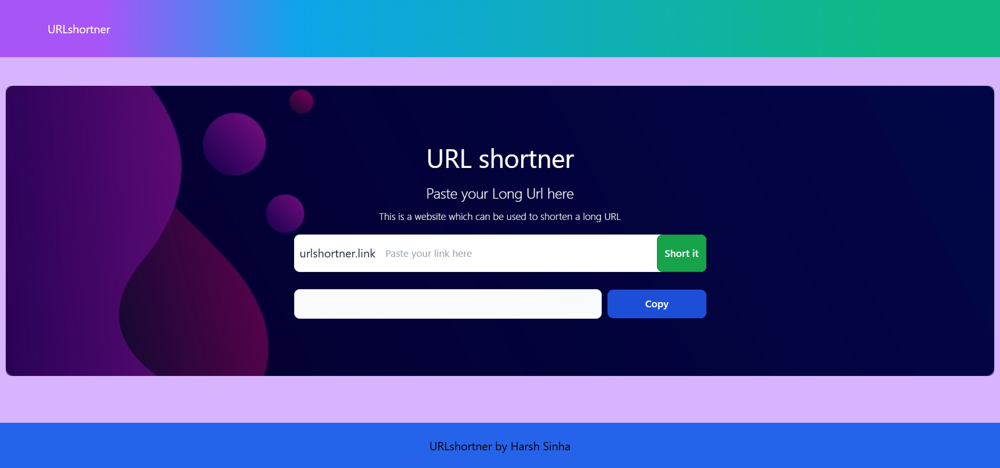

# 🔗 URLshortner

A simple and visually appealing URL shortener web app built using **React + TypeScript** with **Tailwind CSS** and **Node.js + Express.js + MongoDB**. Paste your long URLs and get a shortened version instantly!


## 🚀 Features

- 🧠 Clean and modern UI
- 🔗 URL input and shortening functionality
- 📋 Copy shortened URL to clipboard
- 🧩 Built Frontend with React, TypeScript, and Tailwind CSS
- 💻 Built Backend with Node.js, Express,js and MongoDB
- 📱 Fully responsive layout

## 📦 Technologies Used

- React
- TypeScript
- Tailwind CSS

## 📷 UI Screenshot



> The app is responsive and centered with the footer fixed to the bottom of the screen, regardless of content height.

## 🛠️ Getting Started

### Prerequisites

- Node.js & npm

### Installation

```bash
git clone https://github.com/sinhaharsh24/URL_shortener.git
npm install
npm run dev
```

## 🙌 Credits

Created by **Harsh Sinha**

